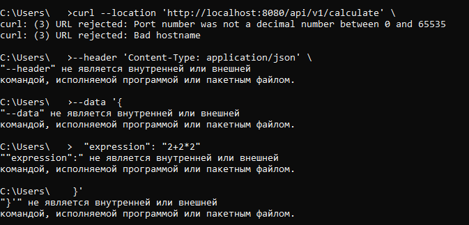
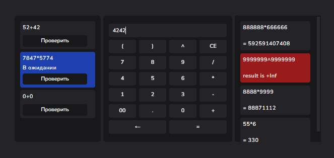
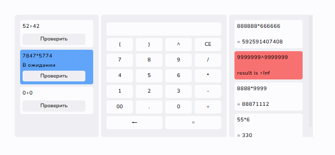

# Calc Service: Распределенная система для вычисления математических выражений
 #### Проверяющему, 
##### Если при проверке решения, найдете недочет или серьезную ошибку, пожалуйста сообщите мне в `Issues` на github, или в телеграм `@artrubadur`, чтобы я мог их исрпавть. Я надеюсь на ваше снисхождение и понимание.
## Описание

Calc Service - это распределенная система, предназначенная для вычисления сложных математических выражений. Она состоит из следующих компонентов:

*   **Web Service:** Предоставляет API для взаимодействия с пользователем. Позволяет отправлять выражения на вычисление и получать результаты.
*   **Orchestrator:** Координирует процесс вычисления, разбивая сложные выражения на простые задачи и распределяя их между агентами.
*   **Agent:** Выполняет отдельные математические задачи, полученные от оркестратора, и возвращает результаты.

## Архитектура
```
calc_2/
│
├── pkg
│   ├── initializer              // Инициализирует логгер и конфигурацию
│   ├── logger                   // Логирует сообщения.
│   ├── models/
│   │   ├── expression.go        // Структуры данных выражения.
│   │   └── task.go              // Структуры данных задач.
│   ├── operators                // Символы математических операций.
│   └── shutdown                 // Завершает сервис.
│
├── config/
│   ├── config.go                // Загружает и обрабатывает конфигурации.
│   └── configs                  // Файлы конфигурации. Выбираются APP_ENV.
│       ├── dev.yaml             // Конфигурация для разработки.
│       └── prod.yaml            // Конфигурация для production.
│
├── web/
│   ├── cmd                      // Точка входа Веб Сервиса.
│   ├── internal/
│   │   ├── router               // Маршруты Веб Сервиса
│   │   └── handlers             // Обработчики запросов Веб Сервису
│   └── static/
│       ├── index.html            // Основной файл интерфейса.
│       ├── favicon.ico           // Иконка, отображаемая в браузере.
│       ├── script.js             // JavaScript код интерфейса.
│       └── style.css             // CSS стили интерфейса.
│
├── agent
│   ├── cmd                       // Точка входа Агента. 
│   └── internal
│       ├── client                // Клиент осуществляющий запросы.
│       └── worker                // Рабочий выполняющий задачи.
│
└── orchestrator/
    ├── cmd                       // Точка входа Оркестратора. 
    └── internal/
        ├── handlers              // Обрабатывает запросы Оркестратору
        ├── middlewares           // Обработчики запросов Окестратору
        ├── router                // Маршруты Окестратора
        ├── task_manager          // Управляет задачами
        └── task_splitter         // Разбивает выражение на задачи


```

## Конфигурация

### Создание конфигурации
Основные параметры конфигурации находятся в файле `config/configs/<name>.yml`.
При установке проекта будут уже доступны 2 варианта запуска: dev и prod.
Вы можете создать свой файл конфигурации в этой же папке.
Выбрать файл конфигурации можно переменной окружения APP_ENV (APP_ENV=dev).
Вы можете изменить её в файле .env.
В зависимости от терминала вы можете перезаписать её следующим образом:

(только для текущей сессии командной строки)
```powershell
$env:APP_ENV="<name>.yml"
```
```cmd
set APP_ENV="<name>.yml"
```
### Процесс применения конфигурации приложением
1. Создается конфигурация по умолчанию
2. Поля связанные с длительностью выполнения математических операций и количество рабочих агента перезаписывают соответсвующие поля в конфигурации по умолчанию
3. Файл APP_ENV.yml перезаписывает все поля (включая env) если они в нем указаны (иначе пропускает)

Вы можете настроить:
*   Порты для каждого сервиса.
*   Параметры логирования (уровень, формат).
*   Время выполнения операций
*   Количество рабочих
*   Ключ авторизации (чтобы на адреса связанные с выполненим задач мог обращаться только агент)
*   CORS 
*   Другие параметры, специфичные для каждого сервиса.

Приложение сможет запуститься при ошибках на 2 и 3 пунктах (переменные среды или файл yml отсутствуют) используя конфигурцаию по умолчанию.


Пример файла `config/configs/<name>.yml`:
```yml
server:
  orchestrator:
    port: 8080
  agent:
    COMPUTING_POWER: 4
  web:
    port: 8081
    static: 'web/static'

math:
  TIME_ADDITION_MS: 100
  TIME_SUBTRACTION_MS: 200
  TIME_MULTIPLICATION_MS: 300
  TIME_DIVISION_MS: 400
  TIME_UNARY_MINUS_MS: 500
  TIME_POWER_MS: 600

middleware:
  api_key_prefix: 'Bearer'
  authorization: 'SuperHardAuthorizationPassword777'
  cors_allow_origin:
    - 'http://localhost:8081'
    - 'http://localhost:8080'

logger:
  level: 1
  time_format: '2006-01-02 15:04:05'
  call_depth: 2
  disable_call: true
  disable_time: false
  disable_color: false

```
## Сборка и запуск

### Сборка (без Docker):

1.  Клонируйте репозиторий:

    ```bash
    git clone https://github.com/OinkiePie/calc_2
    cd calc_2
    ```

2.  Соберите исполняемые файлы для каждого сервиса:

    ```bash
    go build -o build/agent.exe ./agent/cmd/main.go

    go build -o build/orchestrator.exe ./orchestrator/cmd/main.go
    
    go build -o build/web.exe ./web/cmd/main.go
    ```

### Запуск (без Docker):

1.  Проверьте свою конфигурацию (если вы в ней не уверены) в `config/configs/name.yml`.
    
2.  Запустите сервисы в отдельных терминалах:

    ```bash
    build/agent
    build/orchestrator
    build/web
    ```

### Сборка и запуск с помощью Docker:

1.  Клонируйте репозиторий:

    ```bash
    git clone https://github.com/OinkiePie/calc_2
    cd calc_2
    ```

2.  Соберите Docker-образы для каждого сервиса:

    ```bash
    docker build -t agent:latest -f agent/cmd/Dockerfile .

    docker build -t orchestrator:latest -f orchestrator/cmd/Dockerfile .
    
    docker build -t web:latest -f web/cmd/Dockerfile .
    ```

3.  Запустите контейнеры для каждого сервиса:

    ```bash
    docker run -p agent:latest
    docker run -p 8080:8080 orchestrator:latest
    docker run -p 8081:8081 web:latest
    ```

    Если собираетесь изменить файл конфигурации не забудьте указать это при запуске и изменить DockerFIle:
    ```bash
    docker run -e APP_ENV=<файл_конфигурации_с_нужным_портом> -p <порт>:<порт> orchestrator:latest
    ```


### Запуск с помощью Docker Compose (рекомендуется):

1.  Создайте файл `docker-compose.yml` или используйте уже существующий. Пример:

    ```yml
    services:
      agent:
        build:
          context: .
          dockerfile: agent/agent/Dockerfile
        depends_on:
          - orchestrator
      orchestrator:
        build:
          context: .
          dockerfile: orchestrator/cmd/Dockerfile
        ports:
          - "8080:8080"
      web:
        build:
          context: .
          dockerfile: web/cmd/Dockerfile
        ports:
          - "8081:8081"
        depends_on:
          - orchestrator
    ```

2.  Запустите приложение с помощью Docker Compose:

    ```bash
    docker-compose up -d
    ```

## Использование
Вы можете открыть `orchestrator\internal\handlers\handlers.go` и `orchestrator\internal\router\router.go` чтобы увидеть подробное описание каждого запроса, указанное в коментариях, включая параметры, пример корректного овтета или ошибки

Для проверки вычислительных способностей рекомендую использовать веб интерфейс. Если желаете проверить качество запросов используйте команды ниже (если вы изменяли порт не забудьте исправить запрос). 

Не рекомендую использовать стандартный терминал Windows т.к. он не всегда корректно понимает `curl` запросы.

### Пользовательская сторона
#### Для отправки математического выражения на вычисление используйте следующий запрос `curl`:
```bash
curl --location 'http://localhost:8080/api/v1/calculate' \
--header 'Content-Type: application/json' \
--data '{
  "expression": "2+2*2"
}'
```
Ответы:

201 Created:
```json
{
  "id": "уникальный ID созданного выражения"
}
```

422 Unprocessable Entity:

```json
{
  "error": "не удалось прочитать запрос"
}
{
  "error": "не удалось декодировать JSON"
}
{
  "error": "выражения обязательно"
}
```

500 Internal Server Error:

```json
{
  "error": "Содержание ошибки при добавлении выражения в TaskManager"
}

```
#### Для получения списка выражений используйте следующий запрос `curl`:
```bash
curl --location 'http://localhost:8080/api/v1/expressions'
```
Ответы:

200 OK:
```json
{
  "expression": {
    "id": "уникальный ID выражения",
    "status": "статус выражения (pending, processing, completed, error)",
    "result": "результат выражения (может отсутствовать, если вычисления не завершены)",
    "error": "ошибка при вычислении (может отсутствовать, если ошибки нет)"
  }
}
```
404 Not Found:
```json
{
  "error": "выражение не найдено"
}
```
500 Internal Server Error:
```json
{
  "error": "ошибка при кодировании ответа в JSON"
}
```

#### Для получения выражения по его идентификатору используйте следующий запрос `curl`:
(на месте :id вставьте индификатор полученный при отправке выражения (`:` оставлять не нужно))
```bash
curl --location 'http://localhost:8080/api/v1/expressions/:id'
```
Учтите что запрос со статусом `completed` можно запросить только 1 раз: после этого он будет удалён.

Ответы:

200 OK:
```json
{
  "expression": {
    "id": "уникальный ID выражения",
    "status": "статус выражения (pending, processing, completed, error)",
    "result": "результат выражения (может отсутствовать, если вычисления не завершены)",
    "error": "ошибка при вычислении (может отсутствовать, если ошибки нет)"
  }
}
```
404 Not Found:
```json
{
  "error": "выражение не найдено"
}
```
500 Internal Server Error:
```json
{
  "error": "ошибка при кодировании ответа в JSON"
}
```
### Внутрення сторона
Если вы добавили авторизацию не забудьте добавть соответствующий заголовок
#### Для получения задачи для выполнения используйте следующий запрос `curl`:
```bash
curl --location 'http://localhost:8080/internal/task'
```
Ответы:
200 OK:
 ```bash
{
    "task": 
    {
        "id": "уникальный ID задачи",
        "operation": "операция, которую нужно выполнить (+, -, *, /, ^, u-)",
        "args": [], // 2 числа
        "operation_time": "время выполнения задачи",
        "expression": "ID выражения, составной часть которого является задача"
    }
}
   
```

404 Not Found:
```
(пустой ответ) - Если нет доступных задач для выполнения
```

#### Для отправки ответа задачи используйте следующий запрос `curl`:
Не забудьте заменить id выражения и задачи
```bash
curl --location 'http://localhost:8080/internal/task' \
--header 'Content-Type: application/json' \
--data '{
  "expression": "<id_выражения>",
  "id": "<id_задачи>",
  "result": 2.5
}'
```
Тело запроса:
```json
{
    "expression": "ID выражения, частью которого являетя задача",
    "id": "ID выполненной задачи",
    "result": "результат выполнения задачи (число)",
    "error": "ошибка, возикшая при выполнении задачи (может отсутсвовать)"
}
```
Ответы:

200 OK:
```
(пустой ответ) - В случае успешного завершения.
```
422 Unprocessable Entity:
```json
{
  "error": "не удалось декодировать JSON"
}
```
500 Bad Request:
```json
{
     "error": "не удалось декодировать JSON"
}
```
404 Not Found:
```json
{
  "error": "задача не найдена"
}
```

### Дополнительное
Если вы добавили авторизацию не забудьте добавть соответствующий заголовок
#### Для получения всех задач выражения используйте следующий запрос `curl`:
(на месте :id вставьте индификатор полученный при отправке выражения (: оставлять не нужно))
```bash
curl --location 'http://localhost:8080/internal/task/:id'
```
Ответы:

200 OK:
```json
{
  "tasks": [
    {
        "id": "уникальный ID задачи",
        "operation": "операция, которую нужно выполнить (+, -, *, /, ^, u-)",
        "args": "[] (2 числа или nil'ы, если зависит от иногй задачи)",
        "operation_time": "время выполнения задачи",
        "dependencies": "id задач от которых она зависит",
        "status": "статус задачи "pending", "processing", "completed", "error")",
        "result": "результат вычисления задачи (nil если еще не выполнена)",
        "expression" "ID выражения, составной частью которого является задача"
  	}
    ...
  ]
}
```
404 OK:
```json
{
    "error": "выражение не найдено"
}
```
500 Internal Server Error:
```json
{
  "error": "ошибка при кодировании ответа в JSON"
}
```
## Тестирование

Проект имеет тесты, проверяющие работоспособность кода. 
При выполнении команды не забудьте указать путь к файлу.
```bash
go test
```

## Логгирование
Логирование происходит через пакет logger, который инициализируется при запуске сервиса. Вы можете изменить его параметры через файл конфигурации. Параметры, которы можно изменить:

*	level `int` - Текущий уровень логирования.

	1. DebugLevel - логирует все сообщения
	2. InfoLevel - логирует информационные сообщения, предупреждения и ошибки.
	3. WarningLevel - логирует предупреждения и ошибки.
	4. ErrorLevel - логирует ошибки.
	5. FatalLevel - логирует ошибки и затем вызывает os.Exit(1).
	6. Disabled - отключает все логирование.

*	timeFormat `string` - Формат для временных меток
*	callDepth `int` - Глубина вызова для определения файла/строки источника
*	disableCall `bool` - Отключить вывод источника.
*	disableTime `bool` - Отключает временные метки в логах.
*	disableColor `bool` - Отключить цветной вывод.   

## Веб интерфейс
Веб интерфейс представляет собой калькулятор через который вы можете отправлять выражения на выполнение и проверять их статус.

Страница приобретает тему в соответствии с настройками браузера, но вы всегда моежете изменить её кнопкой слева сверху:

 


В центре расположена сама "панель управления". Каждая кнопка вводит ссотвествующий символ. `←` стирает последний символ. `CE` полностью отчищает выражение. `=` отправляет выражение на вычисление. Поле, на котором выводятся нажатые символы, является полем ввода который вы можете изменить "вручную". 



Слеева находится список задач, отправленных на решение. Нажав кнопку `проверить` задача в зависимости от статуса приобритёт синий цвет и подпись "в ожидании" или "выполняется". Если задача была выполнена она удалится из левого списка и появится в правом.

Справа находится список решённых задач. Если задача имеет статус `error` элемент приобретёт красный цвет, и вместо результата появится сообщение о причине ошибки.


